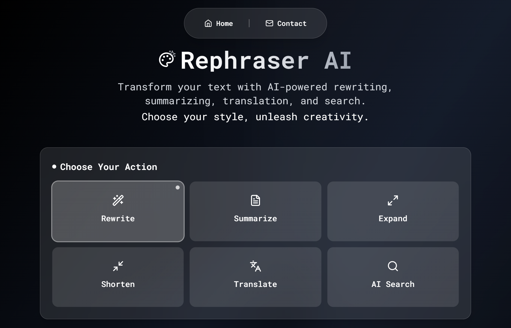

# Rephraser AI - Advanced Text Transformer
## 🖼️ Preview



A beautiful, minimal AI-powered text transformation application built with React, TypeScript, and OpenAI GPT-4. Transform your text with multiple features including rewriting, summarizing, expanding, shortening, and translation while enjoying a modern glassmorphism interface with Roboto Mono typography.

## 🌟 Features

### Text Transformation Options
- **Rewrite**: Change tone and style (12 different tones including Formal, Casual, Creative, GenZ, Sarcastic, and more)
- **Summarize**: Create different types of summaries (TL;DR, Brief, Detailed, Bullet Points)
- **Expand**: Add more detail and depth to your content
- **Shorten**: Make text more concise while preserving key information
- **Translate**: Translate to 40+ languages including major world languages
- **AI Search**: Get comprehensive AI-powered answers and information

### Design & User Experience
- **Minimal Design**: Clean black and white theme with glassmorphism effects
- **Roboto Mono Typography**: Professional monospace font for enhanced readability
- **Responsive Design**: Works perfectly on all devices
- **Copy to Clipboard**: Easy copying of transformed text
- **Character Counter**: Track text length with visual indicators
- **Error Handling**: Comprehensive error messages and validation
- **Smooth Animations**: Loading states, hover effects, and transitions

## 🚀 Getting Started

### Prerequisites

- Node.js (v16 or higher)
- The application uses OpenAI GPT-4 for text transformation

### Installation

1. Clone the repository or download the files
2. Install dependencies:
   ```bash
   npm install
   ```
3. Start the development server:
   ```bash
   npm run dev
   ```
4. Add your OpenAI URL and API_KEY here : [openaiApi.ts](https://github.com/lyaxsh/rephraserai/blob/main/src/services/openaiApi.ts)
5. Open your browser and navigate to the local development URL
6. Start transforming your text immediately!

## 🎨 Design Features

- **Minimal Theme**: Clean black and white aesthetic with subtle gray accents
- **Glassmorphism**: Beautiful glass cards with backdrop blur effects
- **Roboto Mono Font**: Professional monospace typography throughout
- **Dynamic Backgrounds**: Animated gradient backgrounds with pulse effects
- **Responsive Grid**: Adaptive layout for all screen sizes
- **Interactive Elements**: Hover effects and smooth transitions throughout
- **Custom Scrollbars**: Themed scrollbars matching the design aesthetic

## 🛠️ Technology Stack

- **Frontend**: React 18 + TypeScript
- **Styling**: Tailwind CSS with custom components
- **Typography**: Roboto Mono (Google Fonts)
- **Icons**: Lucide React
- **AI API**: OpenAI GPT-4.1
- **Build Tool**: Vite
- **Code Quality**: ESLint + TypeScript ESLint

## 📱 Usage

1. **Choose Action**: Select from 6 transformation options (Rewrite, Summarize, Expand, Shorten, Translate, AI Search)
2. **Select Options**: 
   - For Rewrite: Choose from 12 different tones
   - For Summarize: Select summary type (TL;DR, Brief, Detailed, Bullet Points)
   - For Translate: Select target language from 40+ options
3. **Input Text**: Enter the text you want to transform (max 2000 characters)
4. **Transform**: Click the action button to process your text
5. **Copy Result**: Use the copy button to get your transformed text

## 🔧 Project Structure

```
src/
├── components/              # React components
│   ├── Header.tsx           # Application header
│   ├── FeatureSelector.tsx  # Feature selection interface
│   ├── ToneSelector.tsx     # Tone selection (for rewrite)
│   ├── SummaryTypeSelector.tsx # Summary type selection
│   ├── LanguageSelector.tsx # Language selection (for translate)
│   ├── TextInput.tsx        # Text input with character counter
│   ├── TransformButton.tsx  # Dynamic action button
│   ├── ResultDisplay.tsx    # Results display with copy function
│   └── ErrorMessage.tsx     # Error message component
├── services/                # API services
│   └── openaiApi.ts         # OpenAI API integration
├── hooks/                   # Custom React hooks
│   └── useLocalStorage.ts   # localStorage hook
├── types/                   # TypeScript type definitions
│   └── index.ts             # Application types
├── data/                    # Static data
│   ├── tones.ts             # Tone configuration (12 tones)
│   └── features.ts          # Feature and language configuration
├── App.tsx                  # Main application component
├── main.tsx                 # Application entry point
└── index.css                # Global styles and animations
```

## 🎯 Features Breakdown

### Text Transformation Features
1. **Rewrite**: Transform text tone and style with 12 options including GenZ, Sarcastic, Marketing, Motivational
2. **Summarize**: Create 4 types of summaries (TL;DR, Brief, Detailed, Bullet Points)
3. **Expand**: Add detail and depth while preserving meaning
4. **Shorten**: Condense text while keeping essential information
5. **Translate**: Support for 40+ languages including major world languages
6. **AI Search**: Comprehensive AI-powered search and question answering

### User Experience Features
- Real-time character counting with visual feedback
- Smooth loading states and animations
- Copy-to-clipboard functionality with confirmation
- Dynamic button text based on selected action
- Contextual UI elements (tone selector for rewrite, language selector for translate)

### Design System
- Minimal black and white color palette with subtle gray accents
- Glassmorphism components with backdrop blur
- Roboto Mono typography for professional appearance
- Responsive design with mobile-first approach
- Custom animations and micro-interactions
- Clean, minimal visual elements throughout

## 🌍 Supported Languages

**Major Languages**: English, Spanish, French, German, Italian, Portuguese, Russian, Japanese, Korean, Chinese (Simplified & Traditional), Arabic, Hindi

**Indian Languages**: Bengali, Tamil, Telugu, Marathi, Gujarati, Kannada, Odia, Malayalam, Punjabi, Assamese, Urdu, Sanskrit, Konkani, Maithili, Dogri, Bodo, Santali, Kashmiri

**Other Languages**: Dutch, Ukrainian, Polish, Romanian, Hungarian, Greek, Czech, Slovak, Serbian, Thai, Vietnamese, Indonesian, Malay, Filipino, Nepali, Turkish, Hebrew, Persian, Swahili

## 🔒 Security

- Secure API integration with OpenAI GPT-4
- Input validation to prevent malicious content
- HTTPS-only API calls
- Client-side processing with secure API integration

## 🚀 Deployment

To build for production:

```bash
npm run build
```

The built files will be in the `dist` directory, ready for deployment to any static hosting service like Netlify, Vercel, or GitHub Pages.

## 📝 License

This project is open source and available under the MIT License.

## 🤝 Contributing

Feel free to contribute to this project by:
- Reporting bugs
- Suggesting new features
- Submitting pull requests
- Improving documentation

---

Built with 💜 for seamless text transformation using modern web technologies, minimal design principles, and the power of OpenAI GPT-4.
